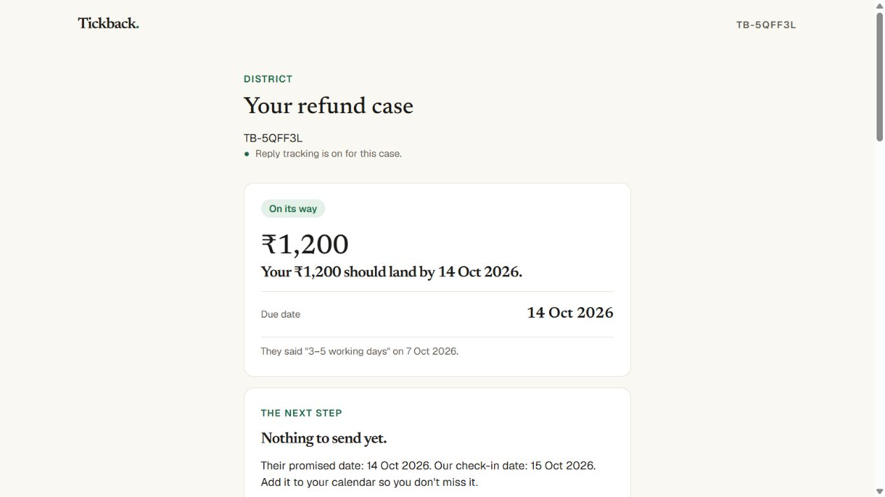
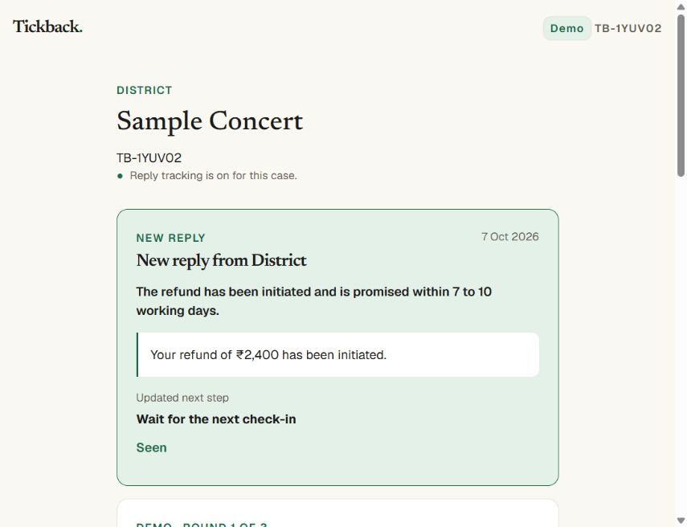
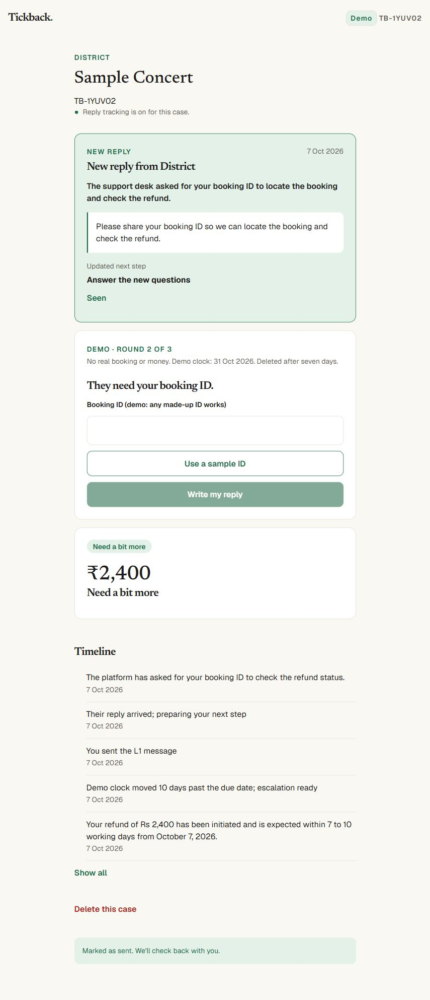
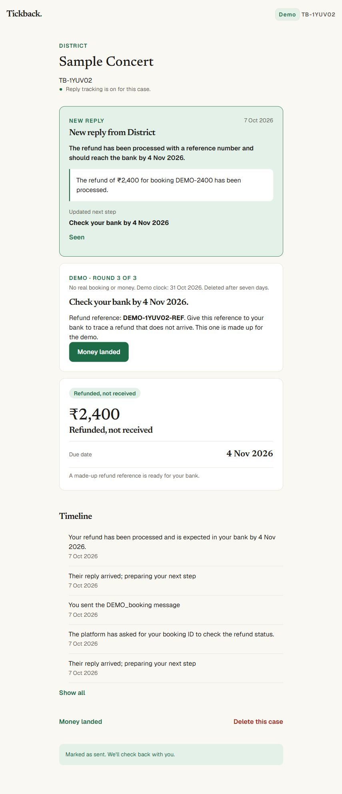
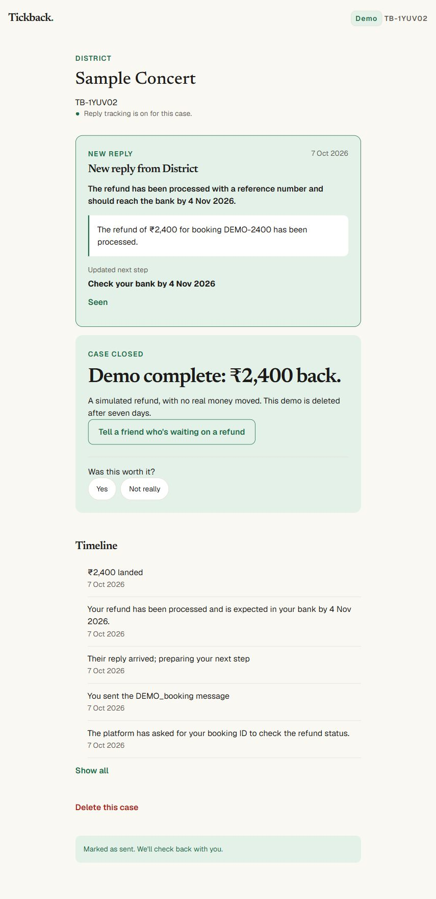
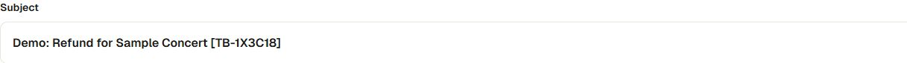

# 2026-10-07 (Codex)

## M2.3 final live proof

- Completed the one-time Responses Sheet connection with Google scope `drive.file`. The app created the private sheet, shared it with the configured reviewer and synced existing cases. The QA check found all 12 required headers, 41 case rows and the M2.3 District proof case. No sheet contents or account details were printed or added to this repository.
- Fixed the in-app browser email handoff. The primary action now opens Gmail through an HTTPS compose page with recipient, subject, body and exact case-inbox CC. The previous email-app handoff remains as a secondary option. A regression test covers the Gmail fields and CC.
- Live District proof case `TB-5QFF3L` was marked sent with the case inbox copied. Before the reply, the case had one watch and zero replies. The next inbox poll matched exactly one later reply-all, recorded one inbox reply and changed the case from `OVERDUE/L0_email` to `TRACE/TRACE_bank`.
- The scheduled per-case Sheet sync remained connected and the District case row remained present after the reply. A manual all-case retry exposed a timeout at 41 rows; the retry now schedules batches of five row updates per second instead of waiting for every Google request in one Convex action. The repaired live retry returned successfully, then the QA check again found 41 rows, correct headers and the proof case.
- The live BookMyShow proof remains `TB-N73ZMT`: two chat replies were read and two next chat lines were produced with chase dates.
- `npx tsc --noEmit` passed. `npm test` passed 38/38. The paid-tier F1-F16 eval already passed on 6 Oct with exact dates and zero invented contacts; report: `docs/qa/eval-2026-10-06.md`.
- Final Convex static-hosting deploy succeeded at https://harmless-lyrebird-924.ap-southeast-2.convex.site. The frozen Vercel demo was not changed.
- M2.3 is READY FOR REVIEW.

## M2.4 live reply banner proof

- Pulled first: fast-forwarded to `5c4787e`, which added D-027 and M2.4. The first implementation was deployed and pushed as `b0700a3`.
- The resumed run found that the inbox check had already saved the new reply on synthetic District case `TB-5QFF3L`. The tracked inbox reply count increased from one to two. No duplicate reply was inserted.
- The input stores sender, received time, one-line AI summary, redacted key sentence and run ID. The existing live case query supplies the top card and its updated next step. Seen stores a timestamp on that input; a later input has its own unseen state.
- Live proof exposed quoted-history contamination: the initial key sentence came from an older email and the summary used an older reference. Fixed the banner extraction to stop at quoted email history and requested a separate newest-reply summary in the existing AI call. Re-ran triage on the already saved input; no new inbox job or matching path was introduced. Existing token-count recording includes this AI call.
- The open live case updated without navigation or refresh: heading `New reply from District`, date `7 Oct 2026`, the newest reference `DSTR-M24-7142`, the organiser's own sentence, and updated next step `Email District support`. Google Calendar was disconnected (the page offered `Connect Google Calendar`), so this also proves the banner does not depend on Calendar permission.
- Clicked Seen. The card disappeared without refresh and the saved input's `seenAt` became `1791360231111`.
- Inbox polling schedule, matching, Calendar alert and Google permissions are unchanged. Existing case triage still reads the full saved history; this milestone changes the banner's summary and quote selection.
- Type check passed; all 41 unit tests passed, including a regression for quoted history. `npm run deploy` completed successfully at https://harmless-lyrebird-924.ap-southeast-2.convex.site.

Saved Convex record before Seen, returned by `qa:latestReplyInput`. Sender address, quoted account names and email addresses are masked for the repository; synthetic case text and other values are unchanged.

```json
{
  "_id": "js758swjcq5zs0nfpgv5817vcn8ftzch",
  "caseId": "jd73m8gwgrmpc09n3768ds3s458fspc4",
  "createdAt": 1791357751897,
  "keySentence": "We have initiated your refund of ₹1,200.",
  "kind": "reply",
  "receivedAt": 1791357663000,
  "runId": "s70mmpdvq4",
  "seenAt": null,
  "sender": "[test sender address masked]",
  "storageIds": [],
  "summary": "District stated that your refund of ₹1,200 has been initiated with reference DSTR-M24-7142 and will reach your bank in 3 to 5 working days.",
  "text": "We have initiated your refund of ₹1,200. It should reach your bank in 3–5\r\nworking days. Reference DSTR-M24-7142.\r\n\r\n\r\nOn Wed, Oct 7, 2026 at 12:20 AM [account name masked] <[email masked]>\r\nwrote:\r\n\r\n>   Your refund has been processed. Please allow 3–5 working days. Refund\r\n> reference: DSTR-DEMO-9087.\r\n>\r\n> On Wed, Oct 7, 2026 at 12:14 AM [account name masked] <[email masked]>\r\n> wrote:\r\n>\r\n>> Hello District team,\r\n>>\r\n>> My booking DIST-DEMO-6402 was ₹1,200.\r\n>>\r\n>> You said the refund would arrive by 15 Sep 2026. I have not received it\r\n>> as of 6 Oct 2026. Please tell me the refund status, return it to my\r\n>> original payment method, and share the refund reference number.\r\n>>\r\n>> Thank you,\r\n>> Kabir Demo\r\n>>\r\n>\r\n"
}
```


- M2.4 is READY FOR REVIEW. This proof covers the banner, saved metadata, live update and Seen; the existing routing/date behavior is outside this change.
- For Ganesh: the existing case reader still anchored this new 3–5 working day reply to the older 15 Sep date and showed 22 Sep as due. The new banner correctly quotes and summarizes the latest reply. The date anchoring needs a separate routing fix before relying on this synthetic case's chase date; M2.4 did not change that logic.

## Reply date reader follow-up, fixed

- Ganesh authorised the follow-up fix. Root cause: triage combined old inputs and quoted email history, then the date-grounding code reused an old anchor and lateness claim for the newest reply.
- Tracked replies are now given to the reader as separate chronological inputs with their actual Gmail received dates and quoted history removed. A new relative refund promise is grounded to that reply's received date in India, unless the organiser explicitly supplies a different start date. Explicit calendar-day promises stay calendar days. An acknowledgement does not restart the previous promise. Unknown conditional starts still require clarification. Pasted inputs without received-date evidence retain the existing date-question behavior.
- Re-read the already saved synthetic District input on `TB-5QFF3L`. No new reply was inserted: inbox reply count stayed two. The old `OVERDUE`, 22 Sep result became `WAIT`, due 14 Oct, with next step `none` and check-in 15 Oct. Seen remains stored, so the previously dismissed banner stayed hidden.
- Saved date facts returned by Convex:

```json
{
  "dueDate": "2026-10-14",
  "messageDate": "2026-10-07",
  "promise": {
    "anchorDate": "2026-10-07",
    "calendarDaysMax": null,
    "date": null,
    "text": "3–5\nworking days",
    "workingDaysMax": 5
  }
}
```

- Live browser proof: `Your ₹1,200 should land by 14 Oct 2026`, `They said "3–5 working days" on 7 Oct 2026`, and `Nothing to send yet` with the 15 Oct check-in.
- Type check passed; 46 unit tests passed. The paid-tier F1–F16 eval passed all 16 cases, all asserted dates exact, zero invented contacts: `docs/qa/eval-2026-10-07.md`. Model unchanged.
- `npm run deploy` succeeded at https://harmless-lyrebird-924.ap-southeast-2.convex.site. Inbox polling, matching, alert delivery and Google scopes are unchanged. The date issue recorded above is resolved for the saved proof case and covered by regression tests.



## M2.5 in flight

- Pulled first to `a988cf3`; M2.4 is READY FOR REVIEW. Building the amended three-round D-027 demo contract.
- Added demo-only case state, clock, expiry and atomic reply reservations capped at three. Only the separate demo connection requests Gmail read/send; real scopes, 10-minute job and calendar alert remain unchanged. Ganesh completed Allow and the backend confirmed connection present. No account credentials or private email content are recorded here.
- Added start-page platform picker, email-only BookMyShow demo, Confirm, skip ahead, booking sample, bank reference and simulated closure/share. Demos are marked in the Sheet platform cell and excluded from payments.
- Fast checks use scheduled per-case actions and session IDs, stop after two minutes for the demo inbox and one minute for case-inbox delivery. They call the existing matching and saveReply path, which re-reads and updates the live query.
- Type check and 54 unit tests pass. Deploy and live proof are still in progress. M2.5 is not READY FOR REVIEW.

- M2.5 preflight: a message from the case inbox was correctly rejected by the no-loop rule. Restarted the proof with a new synthetic District case, TB-1YUV02. Round 1 was sent from the user's own account, replied to in the same Gmail thread (API thread IDs equal), and matched through the case inbox. Desk latency from finding email to send: 2.446 seconds; Mark sent to saved reply: 17.887 seconds. Live case became WAIT, due 21 Oct, check-in 22 Oct, with a new-reply card without refresh. First screenshot: `docs/qa/m2-5-round-1-2026-10-07.png`. Round 2 escalation is awaiting user send.
- Added a bounded retry for timed-out demos. It does not resend a reserved reply. Demo searches start at case creation so a user pausing before Mark sent does not hide their message.
- A broader paid-tier eval found F13 could invent today's message date when the only supplied date was an event date. Grounding now discards that invented start and keeps an explicitly supplied separate message date. Added a regression test. After the fix, all F1–F16 pass with exact asserted dates and zero invented contacts; 56 unit tests pass. No change to real inbox polling, matching, alert delivery or Google scopes.
- Privacy now describes the separate demo desk, three replies, no money moved and seven-day deletion. Live proof and total timing remain unfinished; M2.5 is not READY FOR REVIEW.

## M2.5 full coordinated live run (timing target still open)

- Synthetic District case `TB-1YUV02` completed all three emails through the connected demo desk and existing shared-inbox matching/save/read path. No reply was fabricated in the database. Each organiser send returned the incoming Gmail thread ID. Calendar was not connected.

- Created 19:00:16.182 IST; Money landed closed 19:09:16.242 IST. Full elapsed time: 540.06 seconds (9 minutes). This included chat coordination and sender selection; it does NOT prove the three-minute target. A fresh uninterrupted user run is requested.

| Round | Mark sent (IST) | Desk found (IST) | Desk sent (IST) | Case ready (IST) | Find to reply | Mark sent to ready |
|---|---|---|---|---|---|---|
| 1 | 19:03:28.683 | 19:03:30.847 | 19:03:33.293 | 19:03:49.583 | 2.446 s | 20.9 s |
| 2 | 19:06:14.289 | 19:06:17.900 | 19:06:20.024 | 19:06:33.652 | 2.124 s | 19.363 s |
| 3 | 19:08:41.225 | 19:08:44.697 | 19:08:46.808 | 19:09:01.732 | 2.111 s | 20.507 s |

- Combined time from Mark sent to updated case across the three rounds: 60.77 seconds. This is processing time, not total journey time.

- After round 1: WAIT due 21 Oct, next check-in 22 Oct. Skip ahead moved the simulated clock to 31 Oct and wrote L1. After round 2: booking ID field and sample ID worked; outgoing draft contained DEMO-2400. After round 3: TRACE due 4 Nov, made-up reference explained. Money landed saved CLOSED_LANDED and recoveredPaise 240000; share copy says simulated and no money moved.

- Direct Google Sheets read confirms case row present, Demo marker present and stage matches CLOSED_LANDED. Its empty feedback cell is omitted by Sheets, so the API returned 11 cells in the 12-column range.

- Sanitized saved Convex proof: `docs/qa/m2-5-live-proof-2026-10-07.json`. Three replies as received:

### Received reply 1

```text
Hello and welcome to the Sample Concert.

Your refund of ₹2,400 has been initiated. Please allow 7 to 10 working days
from 7 Oct 2026 for it to reach your original payment method.

Refund desk

Demo reply from Tickback's demo desk, not from District.
```



### Received reply 2

```text
Thank you for contacting us about Sample Concert.

Please share your booking ID so we can locate the booking and check the
refund.

Refund desk

Demo reply from Tickback's demo desk, not from District.
```



### Received reply 3

```text
Welcome to the Sample Concert.

The refund of ₹2,400 for booking DEMO-2400 has been processed. Your refund
reference is DEMO-1YUV02-REF. Please check your bank by 4 Nov 2026. Use
this reference if your bank needs to trace it.

Refund desk

Demo reply from Tickback's demo desk, not from District.
```





- BookMyShow smoke check also created a sample case with Confirm, Demo tag and the explicit email-only explanation. Its draft path is email rather than chat.

- Tightened the AI acknowledgement to thank the customer for contacting support; a welcome-to-the-event greeting falls back to the fixed support acknowledgement.

- M2.5 remains in flight pending the uninterrupted total-time proof.

## M2.5 uninterrupted BookMyShow run: timing gap confirmed

- Ganesh completed a second full run without chat prompts between emails: synthetic case `TB-P6XGW5`. Created 19:11:11.350 IST; closed 19:16:10.966 IST. Total 299.616 seconds (4 minutes 59.616 seconds), above the three-minute target. Do not mark M2.5 READY FOR REVIEW.

| Round | Mark sent | Desk reply after finding | Updated case after Mark sent | Same thread |
|---|---|---|---|---|
| 1 | 19:11:54.524 IST | 2.194 s | 28.835 s | yes |
| 2 | 19:13:56.286 IST | 1.85 s | 17.479 s | yes |
| 3 | 19:15:25.100 IST | 2.114 s | 20.09 s | yes |

- Total reply processing across the three rounds: 66.404 seconds. The remaining elapsed time was between case creation, sending, case buttons and closing; its exact cause is not established. Asked Ganesh which part slowed him down: account selection, finding the next button or reading the case screen.

- All three fixed-ladder replies were actually received, with the revised support acknowledgement. Saved raw synthetic reply text and timestamps: `docs/qa/m2-5-timed-proof-2026-10-07.json`. The case reached TRACE with 4 Nov bank date, then CLOSED_LANDED with the entered simulated amount Rs 2,399. Google Sheets read verifies present, Demo marker, matching closed stage and all 12 cells after feedback.

- Counts-only AI usage for this case: input 5,794; output 2,638; total 8,432. All eight recorded calls used gemini-3.5-flash-lite. Model unchanged.

- Browser limitation: this run was outside the browser surfaces currently connected to Codex. Its timing and records are verified from Convex and Google Sheets; screenshots after each round are from the earlier full District run, explicitly not from this faster BookMyShow run.

- Added Gmail dot/googlemail alias checks so the demo desk never replies to its own or the case inbox's alternate Gmail spelling. 57 unit tests and type check pass. Demo closure now labels its newest-reply next step as Case closed.

- For HQ: functional proof is complete, but the total-time acceptance target is not met. Keep M2.5 in flight until the sender handoff or case steps are shortened and measured again.

- Timing clarification from Ganesh: he manually added a Demo prefix to each outgoing subject. His concern about Gmail account flagging is a concern, not a verified Google rule recorded by Codex. Added automatic `Demo:` prefixes to initial, escalation and booking-ID subjects, preserving the case code. Existing demo drafts also receive the label when opened; real subjects are unchanged. Unit tests cover all three labels, no double prefix, tracking match and unchanged real subjects. 58 unit tests pass. The earlier five-minute run still stands; a run with these labels needs measuring before claiming the three-minute target.

- Automatic subject prefix deployed and seen in the live BookMyShow draft: `Demo: Refund for Sample Concert [TB-1X3C18]`. Its CC control now says Keep it in CC for the demo. No email was sent during this label check. All 58 unit tests, type check and final build pass. Opened the start page and requested a fresh timed user run without subject edits; total-time gate remains open.


