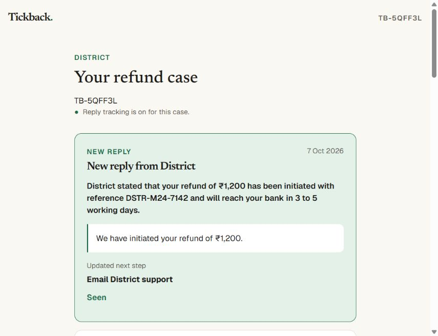

# 2026-10-07 (Codex)

## M2.3 final live proof

- Completed the one-time Responses Sheet connection with Google scope `drive.file`. The app created the private sheet, shared it with the configured reviewer and synced existing cases. The QA check found all 12 required headers, 41 case rows and the M2.3 District proof case. No sheet contents or account details were printed or added to this repository.
- Fixed the in-app browser email handoff. The primary action now opens Gmail through an HTTPS compose page with recipient, subject, body and exact case-inbox CC. The previous email-app handoff remains as a secondary option. A regression test covers the Gmail fields and CC.
- Live District proof case `TB-5QFF3L` was marked sent with the case inbox copied. Before the reply, the case had one watch and zero replies. The next inbox poll matched exactly one later reply-all, recorded one inbox reply and changed the case from `OVERDUE/L0_email` to `TRACE/TRACE_bank`.
- The scheduled per-case Sheet sync remained connected and the District case row remained present after the reply. A manual all-case retry exposed a timeout at 41 rows; the retry now schedules batches of five row updates per second instead of waiting for every Google request in one Convex action. The repaired live retry returned successfully, then the QA check again found 41 rows, correct headers and the proof case.
- The live BookMyShow proof remains `TB-N73ZMT`: two chat replies were read and two next chat lines were produced with chase dates.
- `npx tsc --noEmit` passed. `npm test` passed 38/38. The paid-tier F1-F16 eval already passed on 6 Oct with exact dates and zero invented contacts; report: `docs/qa/eval-2026-10-06.md`.
- Final Convex static-hosting deploy succeeded at https://harmless-lyrebird-924.ap-southeast-2.convex.site. The frozen Vercel demo was not changed.
- M2.3 is READY FOR REVIEW.

## M2.4 live reply banner proof

- Pulled first: fast-forwarded to `5c4787e`, which added D-027 and M2.4. The first implementation was deployed and pushed as `b0700a3`.
- The resumed run found that the inbox check had already saved the new reply on synthetic District case `TB-5QFF3L`. The tracked inbox reply count increased from one to two. No duplicate reply was inserted.
- The input stores sender, received time, one-line AI summary, redacted key sentence and run ID. The existing live case query supplies the top card and its updated next step. Seen stores a timestamp on that input; a later input has its own unseen state.
- Live proof exposed quoted-history contamination: the initial key sentence came from an older email and the summary used an older reference. Fixed the banner extraction to stop at quoted email history and requested a separate newest-reply summary in the existing AI call. Re-ran triage on the already saved input; no new inbox job or matching path was introduced. Existing token-count recording includes this AI call.
- The open live case updated without navigation or refresh: heading `New reply from District`, date `7 Oct 2026`, the newest reference `DSTR-M24-7142`, the organiser's own sentence, and updated next step `Email District support`. Google Calendar was disconnected (the page offered `Connect Google Calendar`), so this also proves the banner does not depend on Calendar permission.
- Clicked Seen. The card disappeared without refresh and the saved input's `seenAt` became `1791360231111`.
- Inbox polling schedule, matching, Calendar alert and Google permissions are unchanged. Existing case triage still reads the full saved history; this milestone changes the banner's summary and quote selection.
- Type check passed; all 41 unit tests passed, including a regression for quoted history. `npm run deploy` completed successfully at https://harmless-lyrebird-924.ap-southeast-2.convex.site.

Saved Convex record before Seen, returned by `qa:latestReplyInput`. Sender address, quoted account names and email addresses are masked for the repository; synthetic case text and other values are unchanged.

```json
{
  "_id": "js758swjcq5zs0nfpgv5817vcn8ftzch",
  "caseId": "jd73m8gwgrmpc09n3768ds3s458fspc4",
  "createdAt": 1791357751897,
  "keySentence": "We have initiated your refund of ₹1,200.",
  "kind": "reply",
  "receivedAt": 1791357663000,
  "runId": "s70mmpdvq4",
  "seenAt": null,
  "sender": "[test sender address masked]",
  "storageIds": [],
  "summary": "District stated that your refund of ₹1,200 has been initiated with reference DSTR-M24-7142 and will reach your bank in 3 to 5 working days.",
  "text": "We have initiated your refund of ₹1,200. It should reach your bank in 3–5\r\nworking days. Reference DSTR-M24-7142.\r\n\r\n\r\nOn Wed, Oct 7, 2026 at 12:20 AM [account name masked] <[email masked]>\r\nwrote:\r\n\r\n>   Your refund has been processed. Please allow 3–5 working days. Refund\r\n> reference: DSTR-DEMO-9087.\r\n>\r\n> On Wed, Oct 7, 2026 at 12:14 AM [account name masked] <[email masked]>\r\n> wrote:\r\n>\r\n>> Hello District team,\r\n>>\r\n>> My booking DIST-DEMO-6402 was ₹1,200.\r\n>>\r\n>> You said the refund would arrive by 15 Sep 2026. I have not received it\r\n>> as of 6 Oct 2026. Please tell me the refund status, return it to my\r\n>> original payment method, and share the refund reference number.\r\n>>\r\n>> Thank you,\r\n>> Kabir Demo\r\n>>\r\n>\r\n"
}
```



- M2.4 is READY FOR REVIEW. This proof covers the banner, saved metadata, live update and Seen; the existing routing/date behavior is outside this change.
- For Ganesh: the existing case reader still anchored this new 3–5 working day reply to the older 15 Sep date and showed 22 Sep as due. The new banner correctly quotes and summarizes the latest reply. The date anchoring needs a separate routing fix before relying on this synthetic case's chase date; M2.4 did not change that logic.
