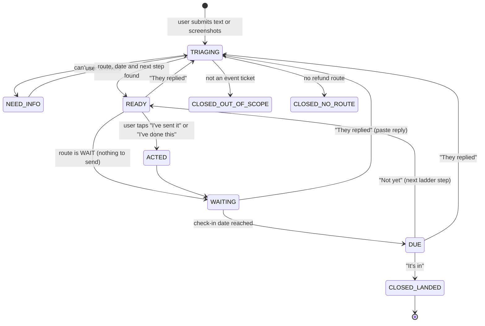

# 01 Product: problem, user, job, stories, flows, onboarding, value, communication

Owner: Claude HQ. Status: DRAFT v1, 4 Oct 2026. Codex reads, never edits. Read `README.md` first.

Working name: **Tickback** (P-5 in the README; one constant in code, easy to change).

---

## 1. The problem

When a live event in India is cancelled, postponed or moved, the buyer's money goes into a fog. The platform says "we don't know yet", then "7 to 10 working days", then nothing. Sometimes there is a form, a refund window that closes, or physical tickets to send back at your own cost. The buyer has to work out what to do, keep the proof, remember the dates and chase. Many give up halfway. The money is rarely refused. People are outlasted.

### Evidence ledger

| Claim | Type | Source |
|---|---|---|
| IPL case: venue moved; support "didn't know" for 3 to 4 days; a Google form; physical tickets couriered at own cost (Rs 150); refund after about 20 days on Rs 2,400 | OBSERVATION (one interview) | `docs/research/user-evidence/2026-10-04_ipl-venue-change-refund.md` |
| The same person would hand the chase to an app | REPORTED, weak (yes/no question, no price) | same |
| In five earlier conversations no company said no; people gave up because chasing cost more than the refund | OBSERVATION (5 interviews, mixed categories) | `docs/research/user-evidence/2026-09-10_outlasted-not-refused.md` |
| 2026 had a run of big cancellations and postponements; IPL 2025 needed a different refund process per match | REPORTED (news) | `06-routes-kb.md` |
| On District, a postponed event's refund is at the organiser's discretion, within a window District tells you; "can't attend" gets no refund | VERIFIED | `06-routes-kb.md` |
| How often event refunds actually get stuck | UNKNOWN | T1 test |
| People will pay Rs 49 for this | HYPOTHESIS | T1 test and the in-product paywall |

---

## 2. The user

**Primary user (v1):** someone in India, roughly 20 to 35, who bought tickets online for a live event (concert, comedy, cricket, festival) on BookMyShow, District or an organiser's own site, often for two or more people, and whose refund is now unclear, late, or tied to steps they don't understand.

What we know or assume about them:
- They live on their phone. Updates arrive as SMS, email, WhatsApp and app notifications. They screenshot things. (OBSERVATION from the interview; common behaviour.)
- They use UPI daily and are comfortable with apps. They do not know escalation routes or consumer rules. (ASSUMPTION)
- They often bought for friends, so they are the one who has to get the group's money back. (HYPOTHESIS; the IPL case was two tickets.)
- A booking is usually worth Rs 500 to Rs 15,000. (ASSUMPTION; confirm in T1.)

**Not v1 users:** flight passengers (next), food and cab users, organisers, anyone who wants legal action.

**The decision bench:** one person. The buyer decides, uses and pays.

---

## 3. The job to be done

> **When** my event ticket refund is unclear or late, **I want** to know exactly where my money is, when it should land and what to do next, **so that** I can stop worrying and get it back without chasing for weeks.

- **Functional:** find the route; know the date; send the right message to the right place; keep the proof; remember to check; go higher when ignored.
- **Emotional:** swap "I don't know what's happening" for "I know the date and the next step".
- **Social (hypothesis):** if I bought for friends, show them I'm on it and get them their share.

### The four forces

| Force | What it looks like |
|---|---|
| **Push** (away from today) | Support says "we don't know". Silence after "7 to 10 days". A form or courier step nobody explained. Real money is stuck. |
| **Pull** (toward us) | A date. One clear next step. Someone else remembering. |
| **Anxiety** (about us) | "Will this app send things as me?" "Is this a scam after my bank details?" "Will the organiser take a message seriously?" "Why pay if the refund may come anyway?" |
| **Habit** (staying put) | Wait and hope. Ask support chat again. Ask ChatGPT for one email. Complain on X. |

### What the product fails without

Four things. Everything else, including design polish, deeper escalation and payments, serves these:
1. **The right route** for this case.
2. **The date** the money should land, with the reason.
3. **One next step**, ready to send from the user's own email or chat.
4. **Memory and return**: keep the case, and come back on the date.

---

## 4. Delta 4

**Today (about 10 steps):** 1 find out what's going on (ask support, wait days) · 2 find the policy · 3 work out what you're owed and how · 4 find the right channel · 5 write the message · 6 attach the right proof · 7 remember the date · 8 check the bank · 9 chase again · 10 find the next level (grievance officer, helpline), or give up.

**With Tickback (4 steps):**
1. Paste the message or a screenshot.
2. See your route, your date and your next step.
3. Tap to send it from your own email (or copy it into the app chat).
4. On the date, tap "It's in" or "Not yet". If not yet, the next step is ready. Back to 3.

---

## 5. Why this is an agent and not a workflow

The agent decides; the user's thumbs send. That split is the product.

| Asking ChatGPT | Tickback |
|---|---|
| Reads one message | Reads every message over the life of the case and remembers what each one changed |
| Gives general advice | Knows the route for this platform and this kind of case, with a source |
| Guesses dates | Computes the due date from the promise or the rule, in code |
| Forgets the case | Keeps the case, the proof and the timeline at one link |
| Never comes back | Puts the check-in on your calendar and moves the case on that date |
| Writes one draft | Changes the next step after each reply: follow-up, grievance officer, helpline |
| Says "it depends" | Tells you honestly when there is no refund route |

The variance is the reason for an agent. Some refunds are automatic, some need a form, some need proof or a ticket returned, some are credit only, some have no route. A fixed workflow cannot handle that spread. The agent reads the situation, picks the route, and re-plans after each reply. When the refund is straightforward, **it says so and sets a check date**, so the user does no extra work.

---

## 6. Routes: the agent's map

Rules behind each date and contact are in `06-routes-kb.md`. Dates are always computed in code (see `05-backend.md`), never by the model.

| Route | When it applies | User sees | Due date rule | Next step |
|---|---|---|---|---|
| `WAIT` | Refund promised and still inside its window | **On its way** | Promised date; else promised working days from the message date; else platform default (District: 10 working days, VERIFIED; BookMyShow: 10 working days, REPORTED); else 10 working days, labelled an estimate | Nothing to send. Save the check-in. Keep the proof listed. |
| `OVERDUE` | The window has passed and nothing landed | **Overdue** | Next check-in 2 working days after the user sends | The next ladder step (below) |
| `ACTION_NEEDED` | The refund needs the buyer to act: a form, choosing refund before a window closes, returning physical tickets | **You need to act** | Deadline from the message; if none, check in after 2 days | Checklist, proof list and the message or form text. When done, switch to `WAIT` with the platform timeline. |
| `TRACE` | Platform says "refunded"; the bank shows nothing | **Refunded, not received** | 3 working days for the platform to send the reference | Ask the platform for the ARN (card) or RRN/UTR (UPI), then give it to your bank |
| `FAILED_PAYMENT` | Money debited, no ticket issued | **Payment failed** | T+5 calendar days from the payment date (RBI, VERIFIED). After that, Rs 100 per day is owed automatically | Inside T+5: wait. Past T+5: write to your bank and the platform, citing the RBI rule |
| `NO_ROUTE` | Buyer can't attend; or the event was postponed and no refund is offered | **No refund route (yet)** | None | Honest answer with the policy and its source. Options: ask whether a refund will be offered (postponed), transfer or resale if the platform allows it, watch for an announcement. No charge. |
| `NEED_INFO` | The agent can't tell | **Need a bit more** | None | Up to 3 one-tap or one-line questions |
| `OUT_OF_SCOPE` | Not an event ticket (flights, food, cabs, shopping, subscriptions) | **Not tickets (yet)** | None | Honest note. Optional waitlist for that category (flights are next). |

### The escalation ladder (v1)

| Level | Name | Channel | Who sends | Clock |
|---|---|---|---|---|
| L0 | **Ask** | Platform support: in-app chat, support email, or web form | User (email opens pre-filled; chat text is copied) | Promised window, or 2 working days for a reply |
| L1 | **Escalate** | Platform Grievance Officer, by email | User, from their own email | Acknowledge in 48 hours, resolve within one month (E-Commerce Rules 2020; shown as "under the rules") |
| L2 | **Go official** | National Consumer Helpline: consumerhelpline.gov.in, 1915, WhatsApp 8800001915 | User files; we prepare the complaint text and the checklist | Partner companies are expected to reply within 30 days |
| Beyond v1 | Consumer Commission (e-Daakhil), chargeback, legal notice | n/a | We say these exist. We don't do them. | n/a |

For `FAILED_PAYMENT` and `TRACE` the ladder is bank-side: L0 the platform for the reference number; L1 the user's bank with that reference; beyond v1, the bank's grievance cell and the RBI Ombudsman (named, not done).

---

## 7. User stories (one at a time, in build order)

UD's rule: one common story first, then add. No abstraction for stories not yet built.

### US-1 (build first): "They said a refund is coming. When?"
As someone whose event was cancelled or postponed and who was told a refund is coming, I want to paste that message and see the date my money should land and what to do now, so that I stop refreshing my bank app and know when to act.

- Given a cancellation message with a booking ID, an amount and "7-10 working days", when I tap **Check my refund**, then within 15 seconds I see route `WAIT`, the amount, a due date equal to the message date plus 10 working days, one sentence explaining where the date came from, and "Nothing to send yet".
- Given the same message when today is past the due date, then I see `OVERDUE` and a ready follow-up to platform support.
- I can add the check-in to my calendar in one tap and copy my case link.

### US-2: "They want me to do something." (the IPL case)
As someone whose match moved venue and who must fill a form and return physical tickets, I want a checklist of exactly what to do, by when, and what proof to keep, so that I don't lose the refund on a technicality.

- Route `ACTION_NEEDED`. Each checklist item has a deadline if the message gives one.
- The proof list names what to keep: courier receipt, tracking number, photo of the tickets before sending.
- **I've done this** moves the case to `WAIT` with the platform's timeline and schedules the check-in.

### US-3: "They replied. What does it mean?"
As someone who sent the follow-up and got a reply, I want to paste the reply and be told what it means and what's next, so that I don't have to decode support language.

- The reply is added to the timeline with one line on what changed.
- The route, the due date or the next step updates. Old check-ins are cancelled and new ones scheduled.

### US-4: "The date passed. Nothing landed."
As someone whose due date has passed, I want the agent to take the next step up the ladder, so that someone with the power to fix it sees my case.

- On or after the due date, opening the case shows the check-in: **It's in** / **Not yet** / **They replied**.
- **Not yet** produces the next ladder step: the grievance officer email with the rule cited, or the National Consumer Helpline complaint text and checklist.
- New check-ins are scheduled for that step's clock.

### US-5: "Refunded, but it's not in my account."
- Route `TRACE`. A ready message asks the platform for the ARN or RRN/UTR.
- When the user pastes the reference, a ready message to their bank appears.

### US-6: "Money went, no ticket came."
- Route `FAILED_PAYMENT`. The due date is the payment date plus 5 calendar days.
- If past it, the screen shows the Rs 100-per-day compensation owed (days late x Rs 100) and a ready message to the user's bank.

### US-7: "I can't go. Can I get my money back?"
- Route `NO_ROUTE`, with the policy sentence and its source.
- Options shown honestly. No false hope. No charge.

### US-8: "It's in!"
- **It's in** closes the case and shows the amount recovered.
- A share card and one-tap feedback appear.

### US-9: "It's not a ticket."
- Route `OUT_OF_SCOPE` with an honest note.
- An optional waitlist (email or phone) for that category.

**Build order:** US-1, then US-2, then US-3 and US-4 together, then US-8. US-5, US-6, US-7 and US-9 are mostly routing and templates once the engine works.

---

## 8. User flows

### 8.1 The case lifecycle (the state machine)

Any state can go to `DELETED` when the user deletes the case.

### 8.2 Flow F1: landing to first value

1. Landing. The user reads the hero and taps **Start my case**, or taps **See a real case** first.
2. Intake. They paste a message, or add screenshots, or tap a situation chip and type one line.
3. They tap **Check my refund**. Progress shows live: Reading your message → Finding your route → Working out your date → Writing your next step.
4. The case page opens: route, amount, due date with its reason, next step. **This is the aha.** Target: under 60 seconds from step 1.
5. The save card offers **Add check-in to calendar** and **Copy my case link**.

### 8.3 Flow F2: acting on the next step

- **Email channel:** **Open in my email** opens the phone's mail app with to, subject and body filled in. Fallback: **Copy message** and **Copy address**. Then **I've sent it**.
- **App chat channel:** the screen shows where to tap in the app (only if verified for that platform), then **Copy for the chat**, then **I've sent it**.
- **Form channel:** the form link (only if it came from the user's own message), the answers to paste, the proof checklist, then **I've done this**.
- The case moves to `ACTED`, then `WAITING`, and check-ins are scheduled.

### 8.4 Flow F3: saving and coming back

- On Android, **Add to calendar** opens a Google Calendar event. On iPhone it downloads an .ics file that opens in Apple Calendar.
- Each event has the case link and one instruction: "Open to tell us if your Rs 2,400 landed."
- The case link is also stored on this device. The landing page shows **Your cases** when it finds them.
- **Send to my WhatsApp** uses the phone's share sheet. This is a share link, not a WhatsApp interface.

### 8.5 Flow F4: check-in on the due date

1. The user opens the link (from the calendar, or by visiting again).
2. A banner asks: "It's 14 Oct. Has your Rs 2,400 landed?" with three answers: **It's in** · **Not yet** · **They replied**.
3. **It's in** closes the case (US-8). **Not yet** gives the next ladder step (US-4). **They replied** opens the paste box (US-3).

### 8.6 Flow F5: paying (cases of Rs 300 and above)

1. After the first next step is shown, the pay card appears: "Want us to stay on it till the money lands? Rs 49."
2. **Pay Rs 49 by UPI** opens the UPI app on Android. iPhone shows the UPI ID and a QR code to copy or scan. The note carries the case code.
3. **I've paid** unlocks the case at once (sprint honour system). Ganesh reconciles daily.
4. If the user doesn't pay, the case stays usable for the free parts. Later ladder steps show a locked preview of what comes next.

### 8.7 Flow F6: out of scope

The case shows "We're starting with event tickets." It names what we heard ("This looks like a flight refund") and offers **Tell me when flights are ready** (email or phone). Nothing is charged.

---

## 9. Onboarding: solve the fear first

UD's rule: find the one or two biggest frictions and solve them in onboarding and on the landing page.

| Friction | How we solve it |
|---|---|
| "Will it send things as me?" | Nothing leaves without your tap. Every message opens in your own email or is copied for your own chat. Said on the landing page, on intake, and on every send button. |
| "Is this a scam? It's my money." | We never ask for OTPs, passwords, card numbers or bank logins. The intake strips card numbers and OTPs before anything is saved. The check is free; pay only after you see value. A real founder name. Delete your case any time. |
| "I don't know what to write." | Paste anything, or add screenshots, or tap a chip: Event cancelled · Postponed · Venue changed · Money gone, no ticket · Says refunded, not received · I can't go. |
| "Will this actually work?" | **See a real case**: a sample case the user can tap through before using their own (the tiny first win). Every date shows its source. |
| "Will I lose track?" | One link. A calendar check-in. Cases remembered on this device. |

- **No sign-up.** The case lives at a private link (P-1).
- **Explain the step inside the flow.** Every action has a one-line why. Example: "Why email? It leaves a dated record a grievance officer can see."

---

## 10. Value: the aha moments

| Aha | What the user sees | Target |
|---|---|---|
| First | Route, due date with its reason, ready next step | Under 60 s from **Start my case**; agent time p50 8 s, p95 15 s |
| Second | The check-in arrives on the right day and the case already knows what's next | Check-in answered within 2 days of the date |
| Third | "Rs 2,400 back." The recovered amount, and the case closed | Within the sprint for at least one case |

---

## 11. Communication (the bonus, built after the three above work)

**v1 (no domain needed):**
- **Calendar check-ins:** one event per check-in date, with the case link and the action.
- **The case link:** copied, shared to self through the share sheet, remembered on the device.
- **In-page check-in banner** when the user returns on or after a check-in date.

**v1.1 (after the domain is verified; behind a feature flag):**
- Optional "Email me on my check-in dates", asked once on the case page, never before value.
- Emails: check-in day ("Has your Rs 2,400 landed?"), overdue ("Your next step is ready"), money landed (thank you, share link). At most one email per check-in. Unsubscribe link in every email.

**Founder touch (manual, sprint only):** an optional field, "Can the founder check in with you about this case?" (email or phone). Ganesh personally follows up with the first users who say yes.

**Share loop (Greed, from the lock sheet):** the money-landed card reads "Got Rs 2,400 back from a cancelled show. Tickback chased it." with a link to the landing page.

**Never:** marketing blasts, or anything sent to an organiser on the user's behalf.

---

## 12. Pricing and the paywall

Builds on D-009.

| Case amount | What's free | What Rs 49 adds |
|---|---|---|
| Under Rs 300 | Everything | n/a |
| Rs 300 and above | Route, due date, first next step, calendar check-in | "Stay on it till the money lands": every later follow-up and escalation step, reading replies, re-planned check-ins, proof checklist per step |

- **When we ask:** right after the user has seen the first next step. Never before value.
- **Guarantee (P-2, needs Ganesh's OK):** D-009 says a 14-day money-back guarantee. Proposal: an outcome guarantee instead, "If your refund doesn't land, we refund your Rs 49." Reason: refunds commonly take 10 or more working days (District says 7 to 10; the IPL case took about 20 days), so a 14-day window would trigger before most refunds land.
- **Collection in the sprint (P-3):** a UPI link to Ganesh's UPI ID with the case code in the note. **I've paid** unlocks at once. Ganesh reconciles daily. If a payment can't be found, the case shows a polite note and re-locks. iPhone shows the UPI ID and a QR code because iOS has no UPI app chooser.
- **After the sprint:** a payment gateway with automatic verification.
- The T1 DM test still runs with an open price (Q-006). This paywall is the in-product version of the same test.

---

## 13. Success metrics for the sprint

**North star:** rupees recovered for users (the sum of amounts on cases closed as landed).

**Funnel** (every step is a logged event; see `05-backend.md`):
visit → started case → aha seen → acted (opened email or copied) → saved (calendar or link) → paid → check-in answered → landed.

**Targets for 9 to 17 Oct:**
- At least 10 real cases started.
- At least 5 acted.
- At least 2 paid on Rs 300+ cases (D-009 pass rule).
- At least 1 refund landed and shared.

**Quality bars:**
- Route accuracy on the eval set: at least 9 of 10.
- Zero invented contacts.
- Time to aha: p50 8 s or less.

**Learning signals:**
- Share of `OUT_OF_SCOPE` cases by category, which measures demand for flights and others.
- Share of `NEED_INFO` cases, which measures how clear the intake is.
- Drop-off at the paywall.

---

## 14. Guardrails the agent never breaks

1. Never ask for OTPs, passwords, PINs, card numbers or bank logins.
2. Never send anything to anyone. The user sends.
3. Never invent a contact, a deadline, a rule or a policy. If unknown, say so and say where to look.
4. Every date shows where it came from.
5. Not legal advice. Say so once, plainly, in the footer and the FAQ.
6. No threats in drafts. Firm, specific, polite.
7. No dark patterns: no fake urgency, nothing pre-ticked, no hidden fees.
8. Delete means delete.

---

## 15. Assumptions, risks and what would prove us wrong

| # | Assumption | Confidence | How we find out | If wrong |
|---|---|---|---|---|
| A1 | Enough people have a live stuck event refund during the sprint | Low to medium | T1 DMs; started-case count | Switch v1 to flights (D-010 rule: fewer than 3 of 10 with a live case) |
| A2 | Route + date + next step feels worth paying for | Medium | Paywall conversion | Pay-after-success, Rs 29 to 99 (D-009) |
| A3 | Organisers and grievance officers respond to emails | Medium | First 5 acted cases | Lean on L2 (helpline) earlier |
| A4 | Users will send from their own email | Medium | Acted rate | If under 30%, it's a trust or onboarding problem; test copy-for-chat first |
| A5 | Calendar check-ins bring people back | Medium | Check-in answered rate | Prioritise the domain and email (v1.1) |
| A6 | Route accuracy holds on messy real messages | Medium | Eval set, then the first 20 real cases | Add a confirm step: "Is this right?" before the plan |
| A7 | BookMyShow contacts are correct | Low until checked | Ganesh checks bookmyshow.com by hand | Show "check this on the BookMyShow site" instead of an address |
